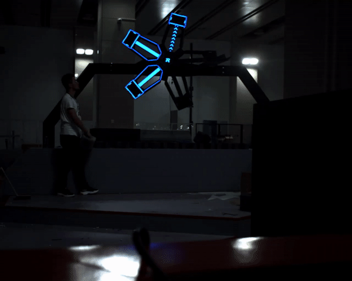
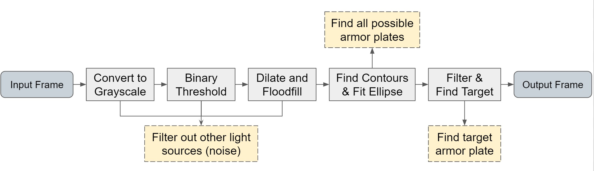
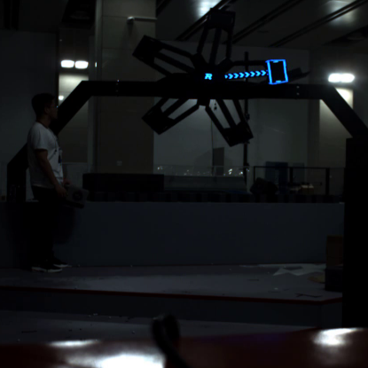
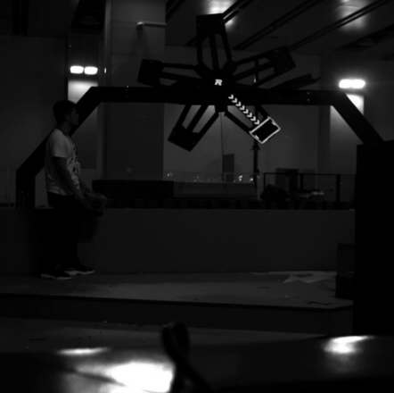
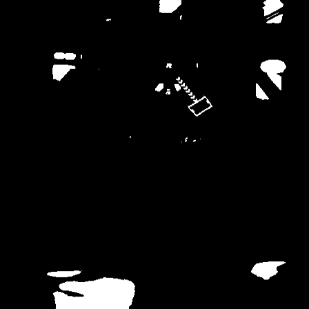
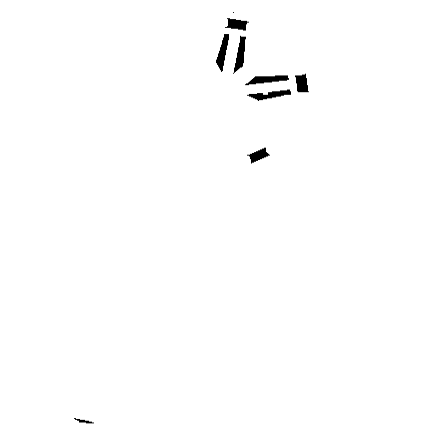
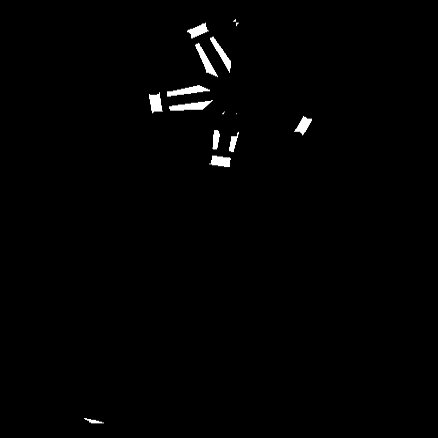
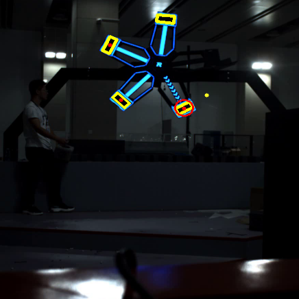

# Using traditional CV methods for detecting power rune and robot armor plates

## Power Rune

### Introduction
The power rune is a windmill shaped device located at the center of the playing field. It has an armour plate mounted at the tip of each of its five fan blades, and the robots have to hit the armour plates that light up. If they successfully hit all the armour plates in the correct order, the power rune will be activated and their team will gain a buff. The power rune has two forms: one is stationary, where the fan blades are not moving ("small rune"); the other is rotationary, where the fan blades rotate at a certain velocity ("big rune").

     

### Method
Since detecting the armor on the runes needs to be a quick decision process with little latency, the approach to solving this problem needs to be fast and accurate. One possible approach is using machine learning/deep learning, to train the model to recognize the armor plates. However, no ready-made dataset is available, and there is not much resources available to make a custom dataset that can fulfill the training task. 

Therefore, a **traditional OpenCV approach** is taken to extract features from the frame and determine the armor target. A Kalman Filter is also applied to estimate and predict the approximate position of the next armor to target. Here is a flowchart showing the process:

   

Here are some OpenCV functions used and the results they resturn:

     
  <h4 align="center">Original Frame, cvtColor(COLOR_BGR2GRAY), thresh(THRESH_BINARY)</h4> 

     
  <h4 align="center">Dilate, FloodFill, thresh(THRESH_BINARY_INV)</h4> 

   
  <h4 align="center"> DrawContour </h4> 

### Results
In the end, the system successfully detects all the armor plates, along with the armor plate that needs to be targeted next. The center of each armor plate is obtain and marked on the frame, and a circle is placed around the target armor plate. Here is a short demo:

   

