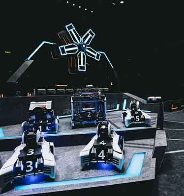
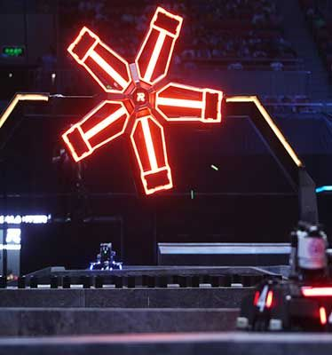
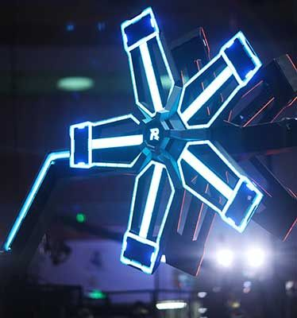

# RobomasterComputerVision-CYL

## Robomaster Competition
The RoboMaster program is a platform for robotic competitions and academic exchange founded by Da-Jiang Innovations (DJI) and specially designed for global technology enthusiasts. The RoboMaster University Series has been expanding its influence year by year, attracting more than 400 colleges and universities around the world to participate annually and nurturing the engineering talents of over 35,000 young learners. For more information please check [RoboMaster Website](https://www.robomaster.com/en-US)

During the competition, robots from two teams battle each other on the arena by shooting pellets at armor plates mounted on the robots. The rules and format are somewhat similar to League of Lengends (LOL). Computer vision is widely used on the robots to track and detect opponent robots and perform autoaiming and shooting. There is also a power rune that robots have to target to earn energy buffs during the competition, which also requires computer vision.

   

## Power Rune

#### Introduction
The power rune is a windmill shaped device located at the center of the playing field. It has an armour plate mounted on each of its five fan blades, and the robots have to hit the selected armour plates in the order they light up. If they successfully hit all the armour plates in the correct order, the power rune will be activated and their team will gain a buff. The power rune has two forms: one is stationary, where the fan blades are not moving ("small rune"); the other is rotationary, where the fan blades rotate at a certain velocity ("big rune").

    

#### Method

#### Results
